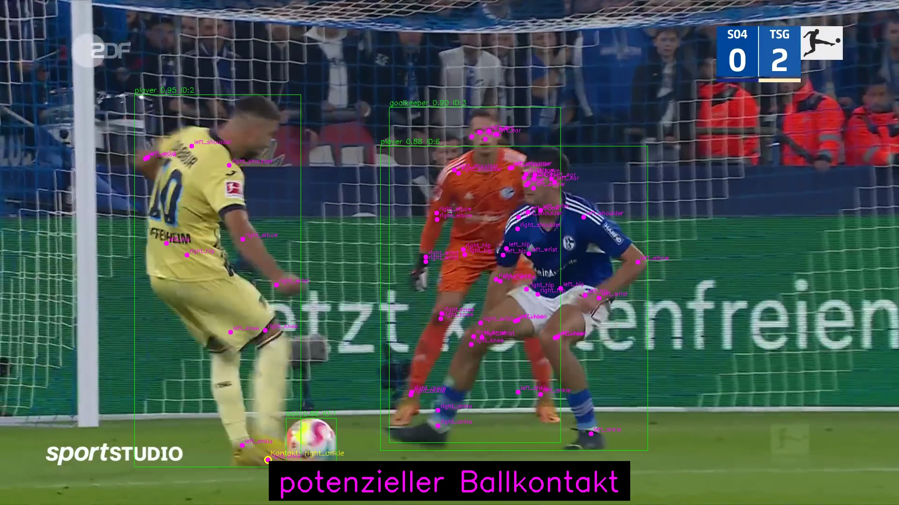

# KI-Modell zur Erkennung von Ballkontakten in Fußball-Spielszenen
▶ [YouTube-Demo ansehen](https://youtu.be/zFxMEwBQ8Y0)

## Woraus besteht das Modell?
```text
    • Object Detection (Erkennung von relevanten Objekten)
    • Object Tracking (Nachverfolung von Objekten im Video)
    • Pose Estimation (Erkennung der wichtigen Keypoints von jedem Objekt)
    • Tiefenschätzung (zur Schätzung der Entfernung zwischen Ball & Keypoint)
```

## Genutzte Modelle:
```text
    • Object Detection: selbst trainiertes Modell auf Basis eines vortrainierten YOLO-Modells
    • Object Tracking: ByteTrack
    • Pose Estimation: yolo11x-pose
    • Tiefenschätzung: DPT_Large aus dem MiDaS-Projekt
```

## Welche Objekte erkennt das Object-Detection-Modell?
```text
    • 🧍‍♂️ Feldspielern
    • 🧤 Torhütern
    • 🧑‍⚖️ Schiedsrichtern
    • ⚽ Ball
```
 
## Warum Tiefenschätzung?
Zuvor wurde ein 2D-Vergleich zwischen Keypoints und dem Ball vorgenommen.
Jedoch wäre dies nicht ausreichend, weil die Tiefe in den Bildern natürlich auch sehr relevant ist.

## Projektstruktur
```text
football-ball-Contact-detection-model/
├── main.py                            # Code zur Analyse von Videos zur Ballkontakt-Erkennung
├── Training_detection_model.ipynb     # Jupyter-Notebook zum Trainieren des Object Detection-Modells              
└── Beispielbilder/                    # Beispiel an extrahierten Frames, die Ballkontakte erkannt haben   
```

## Ergebnisse:
Demo des aktuellen Stands: ▶ [YouTube-Demo ansehen](https://youtu.be/zFxMEwBQ8Y0)

Beispielbild:

